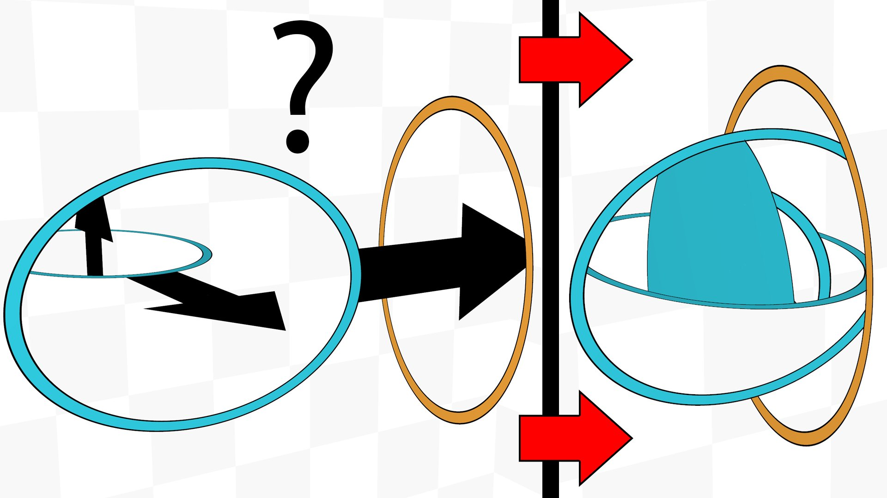
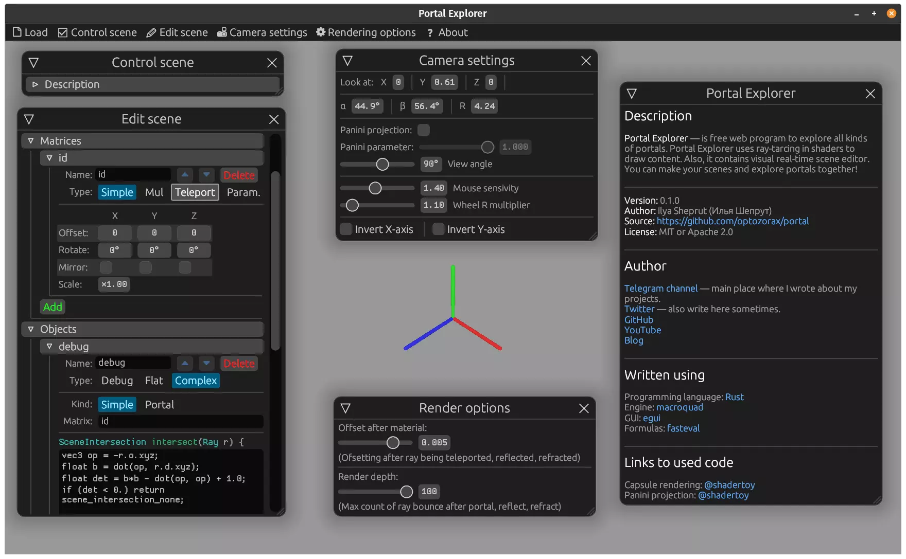
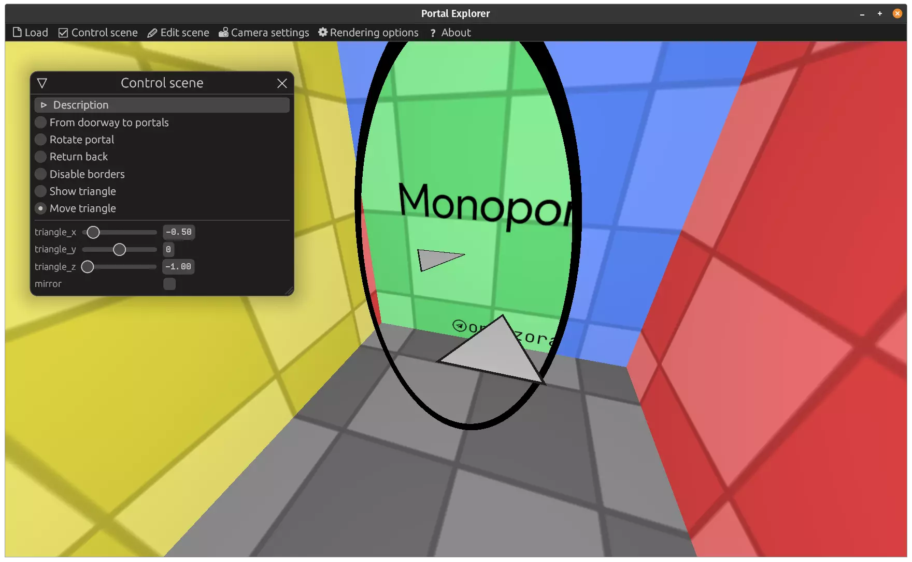
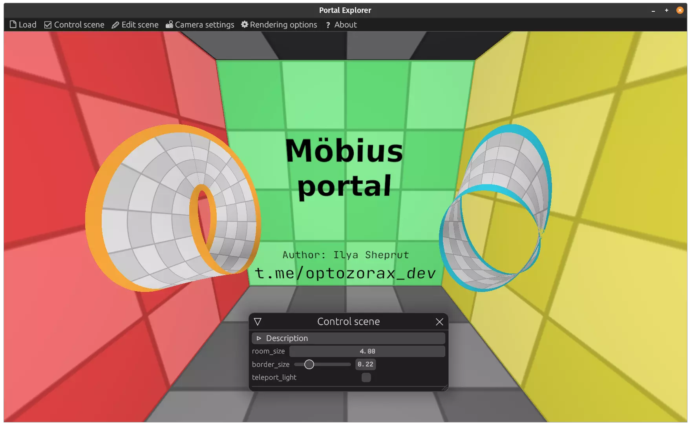
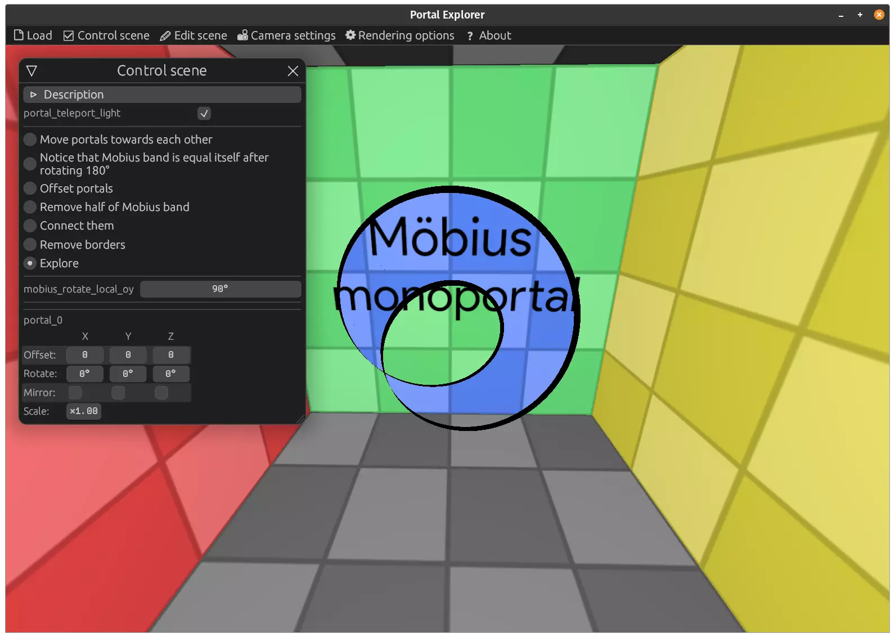
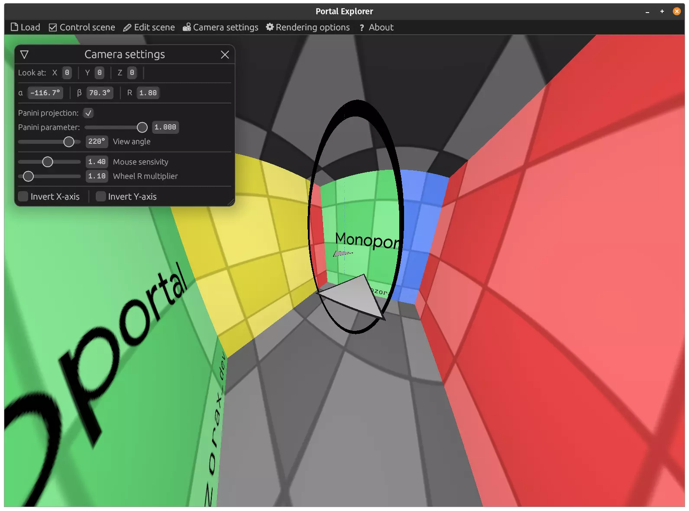
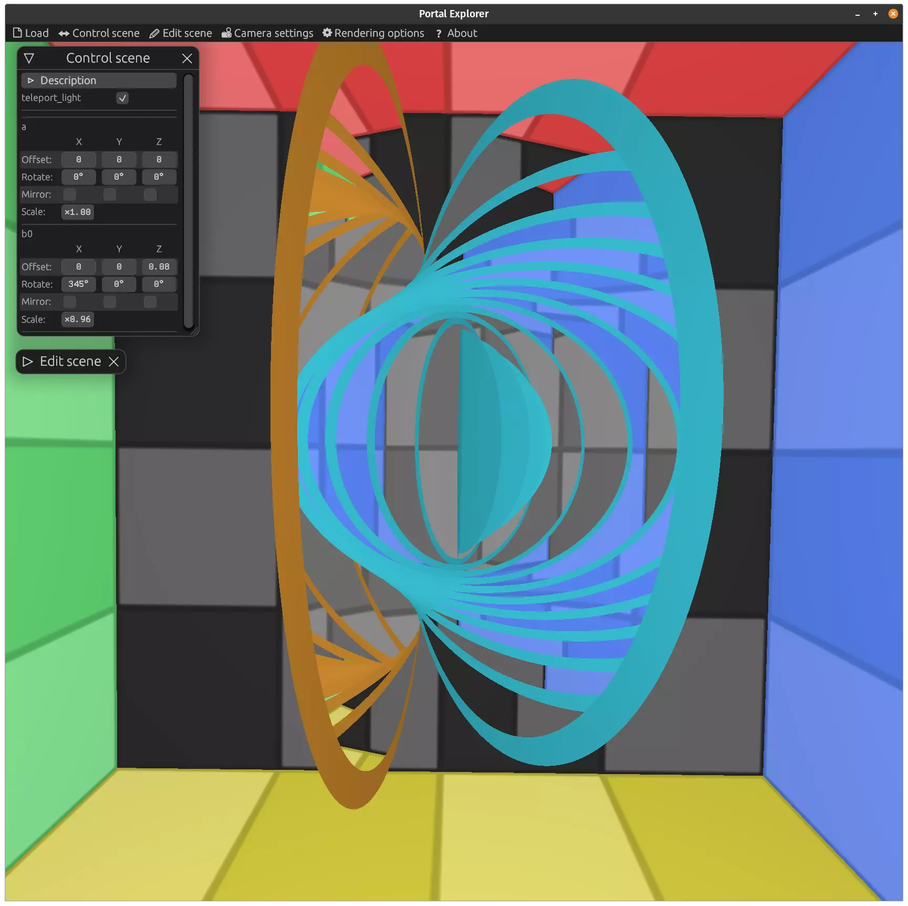

# Portal explorer

**Portal explorer** is a web visualizator of mind-blowing portals.

In Portal Explorer you can view how interesting portals are constructed, and visually explore their properties by moving and rotating them. This program doesn't work well on mobile, better opened from PC.

# My video

I made a YouTube video about what will happen if we put one portal into another with a detailed explanation about how it works.

Video has English subtitles (but the main language is Russian).

[https://youtu.be/1q0sHf_n_2Y](https://youtu.be/1q0sHf_n_2Y)

# Scenes

* Basics
	* [Basics](https://optozorax.github.io/portal/?scene=basics)
	* [Moving doorway](https://optozorax.github.io/portal/?scene=moving_doorway)
	* [Speed model](https://optozorax.github.io/portal/?scene=speed_model)
	* [Non linear movement](https://optozorax.github.io/portal/?scene=non_linear)
	* [Same shape](https://optozorax.github.io/portal/?scene=same_shape)
	* [Cutting prism](https://optozorax.github.io/portal/?scene=cut_prism)
	* [Cutting plane](https://optozorax.github.io/portal/?scene=cut_plane)
* Monoportals
	* [Monoportal](https://optozorax.github.io/portal/?scene=monoportal)
	* [Rotating monoportal](https://optozorax.github.io/portal/?scene=monoportal_rotating)
	* [N-monoportal](https://optozorax.github.io/portal/?scene=monoportal_n)
	* [Offsetting monoportal](https://optozorax.github.io/portal/?scene=monoportal_offset)
	* [Offsetting monoportal 2](https://optozorax.github.io/portal/?scene=monoportal_offset2)
	* [Scaling monoportal](https://optozorax.github.io/portal/?scene=monoportal_scale)
	* [Scaling monoportal](https://optozorax.github.io/portal/?scene=monoportal_scale2)
	* [Logarithmic spiral portal](https://optozorax.github.io/portal/?scene=monoportal_log)
* [Triple portal](https://optozorax.github.io/portal/?scene=triple_portal)
* Mobius band
	* [Mobius portal](https://optozorax.github.io/portal/?scene=mobius)
	* [Mobius monoportal](https://optozorax.github.io/portal/?scene=mobius_monoportal)
* [Hopl Link portal](https://optozorax.github.io/portal/?scene=hopf_link)
* Portal in portal
	* [Portal in portal: two pairs](https://optozorax.github.io/portal/?scene=portal_in_portal_two_pairs)
	* [Ellipse portal in portal](https://optozorax.github.io/portal/?scene=portal_in_portal)

# Screenshots

