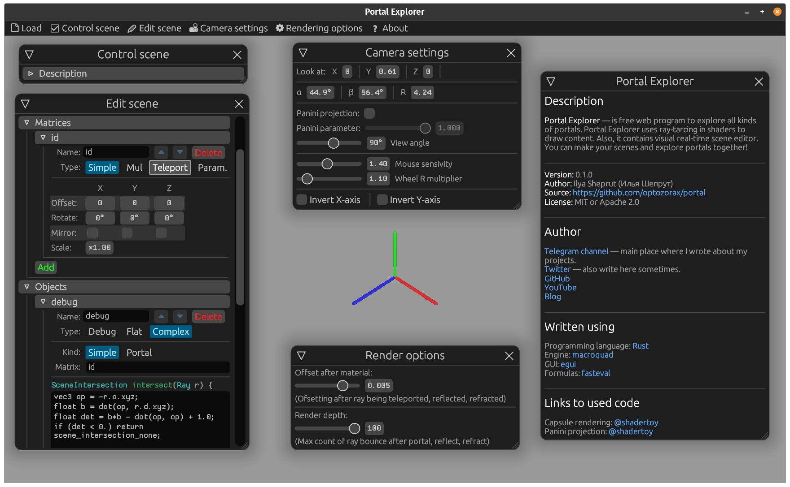
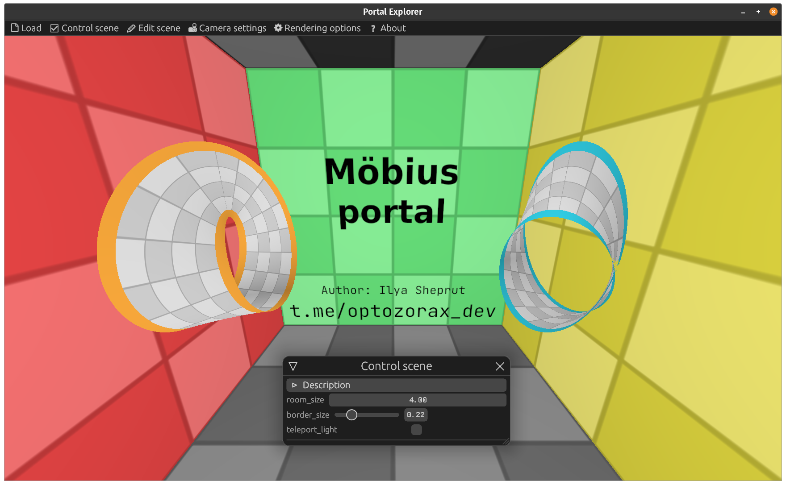
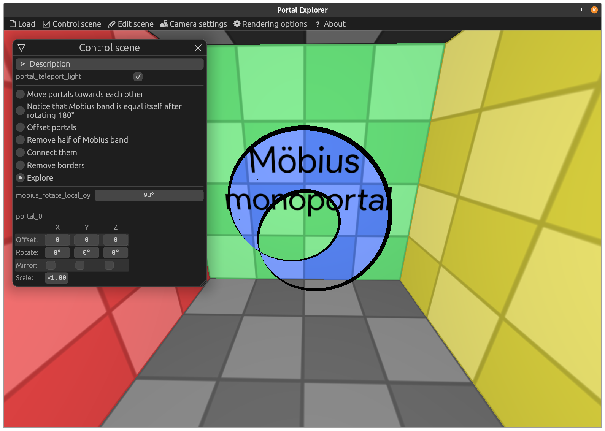
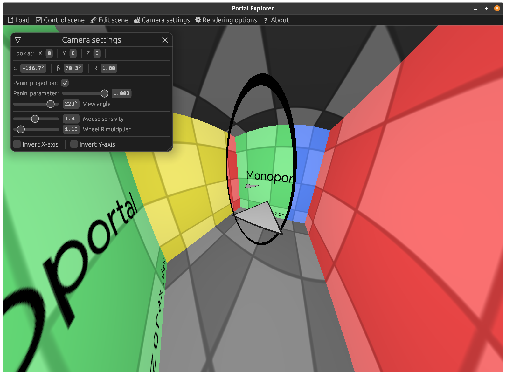
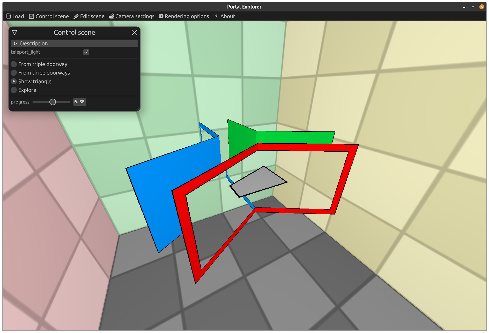
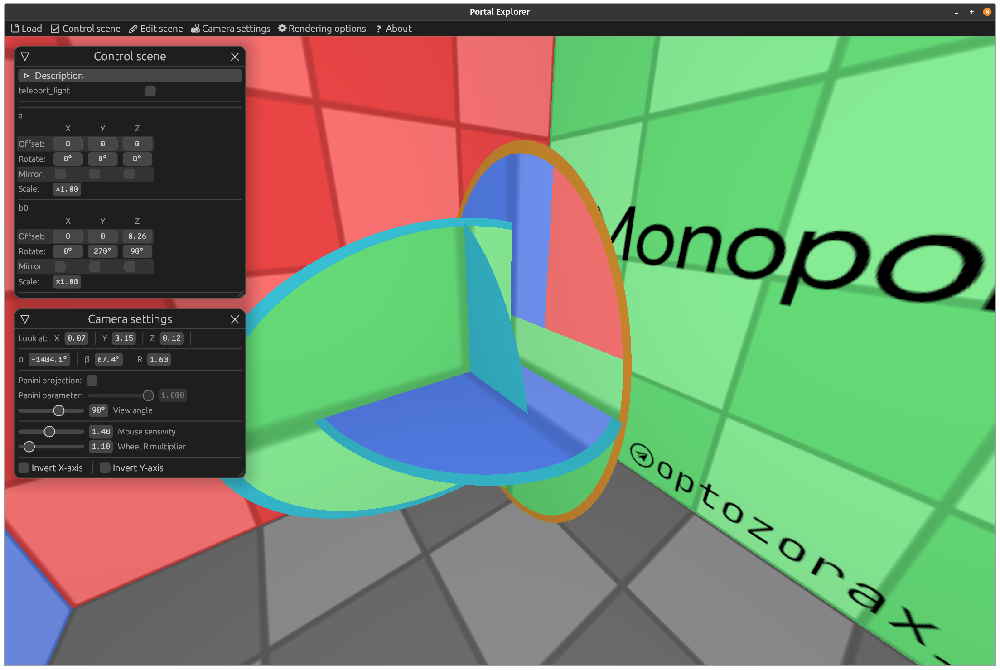
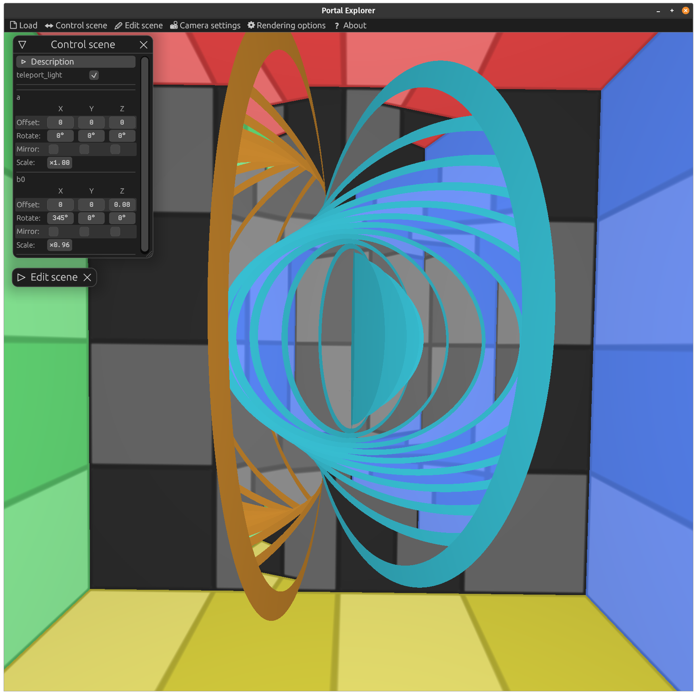

# Portal explorer

**Portal explorer** is a web visualizator of mind-blowing portals.

In Portal Explorer you can view how interesting portals are constructed, and visually explore their properties by moving and rotating them. This program doesn't work well on mobile, better opened from PC.

# Scenes

* [Monoportal](https://optozorax.github.io/portal/?scene=monoportal)
* [Mobius portal](https://optozorax.github.io/portal/?scene=mobius)
* [Mobius monoportal](https://optozorax.github.io/portal/?scene=mobius_monoportal)
* [Triple portal](https://optozorax.github.io/portal/?scene=triple_portal)
* [Portal in portal](https://optozorax.github.io/portal/?scene=portal_in_portal)
* [Hopl Link portal](https://optozorax.github.io/portal/?scene=hopf_link)

# Screenshots

